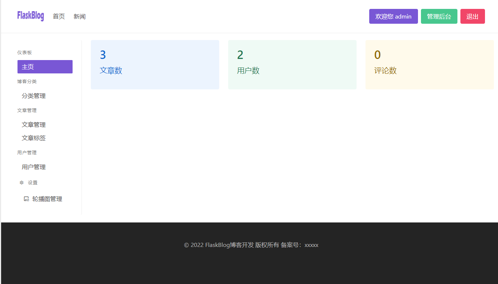
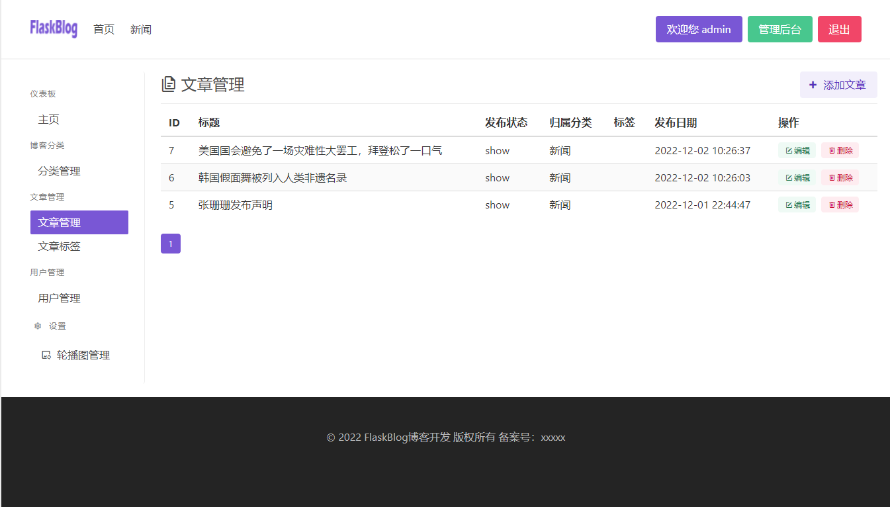
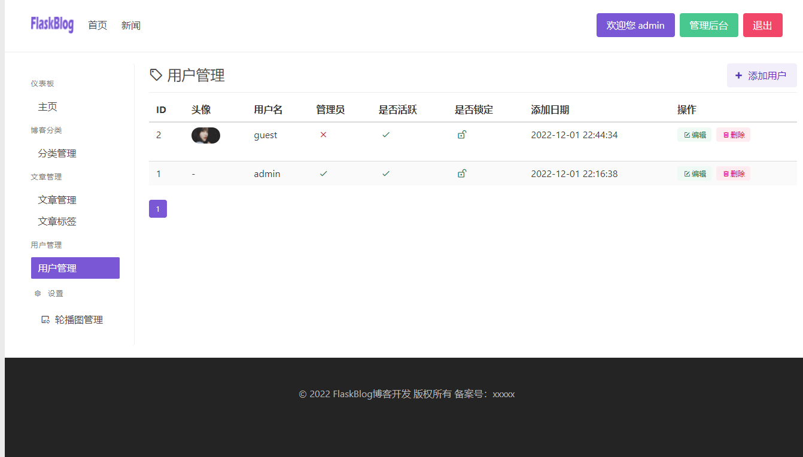
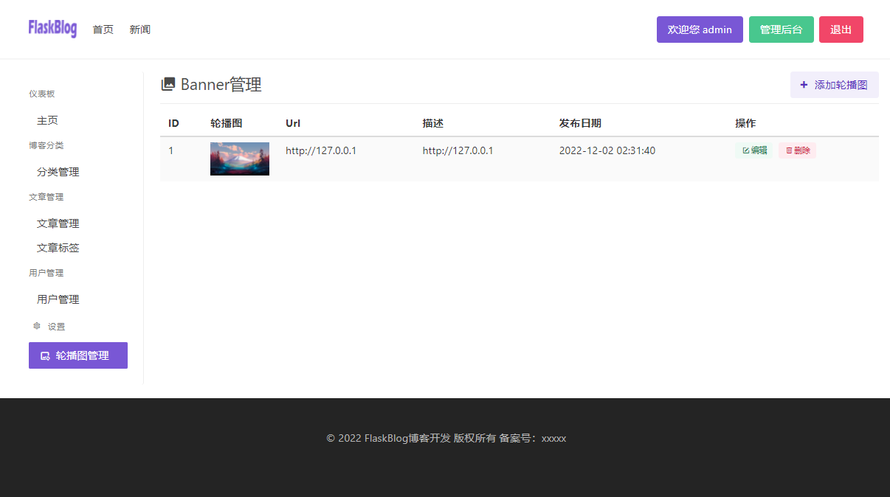
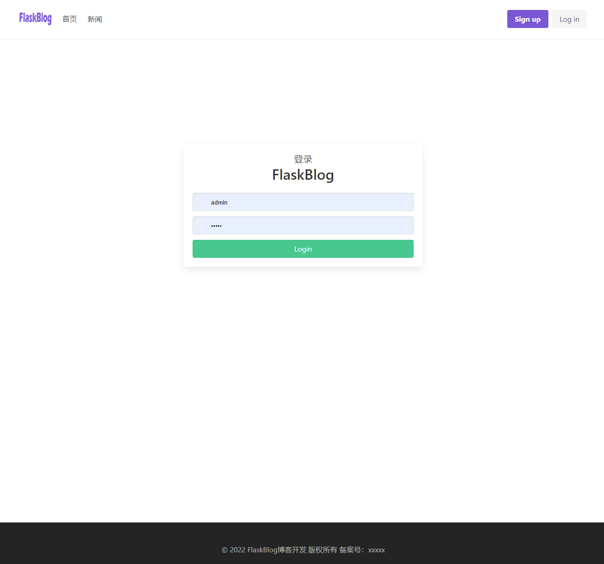
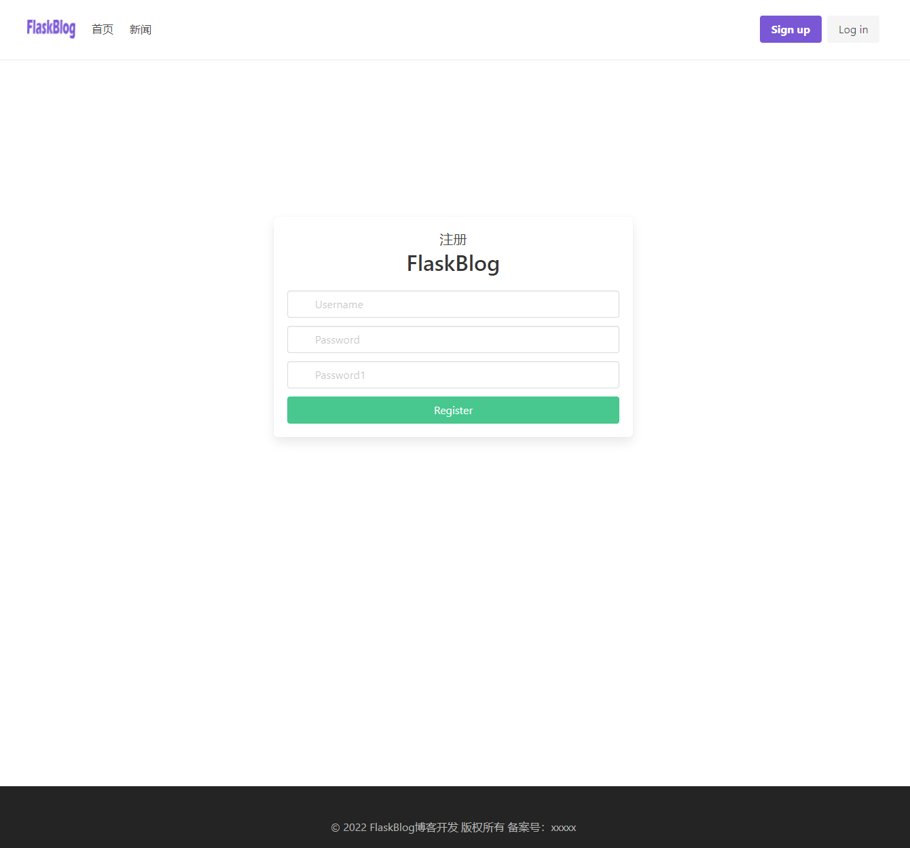

## FlaskBlog
## 简介
本博客代码是基于[bilibili-up-轻编程](https://space.bilibili.com/432627585) 开发的blog基础上采用flask进行开发而成

## 效果展示
首页


管理后台



文章管理




用户管理



banner轮播图管理




登录



注册



侧边栏搜索


文章详情


## 涉及功能
```text
登录
注册
后台管理
分类管理
文章管理
用户管理
全站导航菜单栏
文章列表
文章详情
集成富文本编辑器
侧边栏文章归档
权限管理
banner轮播图管理
```


## 快速使用
采用docker image的形式快速上手展示
账户名密码：admin/admin

借鉴：https://www.cnblogs.com/sdadx/p/10360208.html
```text
docker run -d -it --network host --name python -v /root/nginx/:/nginx/ -v /etc/nginx:/etc/nginx python  bash
docker exec -it python  bash
cd /nginx/nginx-1.18.0

useradd nginx -M -s /sbin/nologin 
./configure  --prefix=/etc/nginx/ --sbin-path=/usr/local/bin/ --user=nginx --group=nginx   --with-http_ssl_module  --with-http_stub_status_module --conf-path=/etc/nginx/nginx.conf  --error-log-path=/var/log/nginx/error.log --http-log-path=/var/log/nginx/access.log --pid-path=/var/run/nginx.pid
make && make install

cd ../FlaskBlog-master
pip install uwsgi
pip install -r requirements.txt

[root@es-1 FlaskBlog-master]# cat config.ini
[uwsgi]
socket = 127.0.0.1:8080
home = /usr/local
wsgi-file = ./manage.py
callable=app
processes = 1
threads = 1
buffer-size = 32768
master = true
stats=./uwsgi.status
pidfile=./uwsgi.pid

uwsgi config.ini 

[root@es-1 ~]# cat /etc/nginx/nginx.conf
user nginx;
worker_processes auto;
error_log /var/log/nginx/error.log;
pid /run/nginx.pid;

include /usr/share/nginx/modules/*.conf;

events {
    worker_connections 1024;
}

http {
    log_format  main  '$remote_addr - $remote_user [$time_local] "$request" '
                      '$status $body_bytes_sent "$http_referer" '
                      '"$http_user_agent" "$http_x_forwarded_for"';

    access_log  /var/log/nginx/access.log  main;

    sendfile            on;
    tcp_nopush          on;
    tcp_nodelay         on;
    keepalive_timeout   65;
    types_hash_max_size 4096;

    include             /etc/nginx/mime.types;
    default_type        application/octet-stream;

    include /etc/nginx/conf.d/*.conf;

    server {
        listen 80;
        #server_name 127.0.0.1;
        location / {
            include uwsgi_params;
            uwsgi_pass 127.0.0.1:8080;
         }
    }
}


nginx 
```
