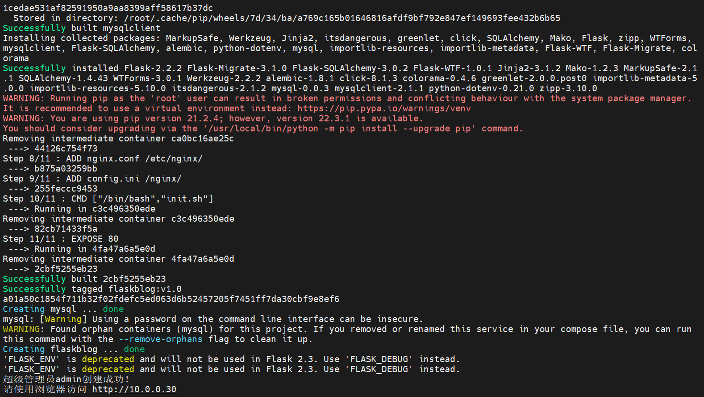
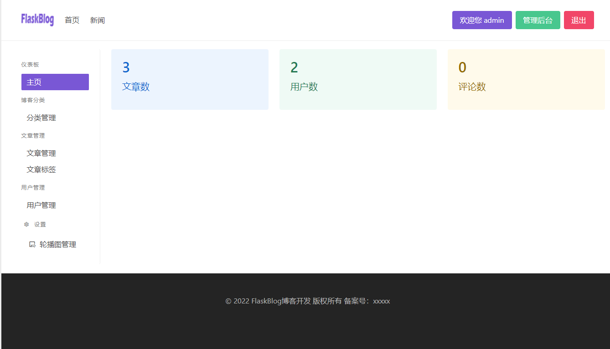
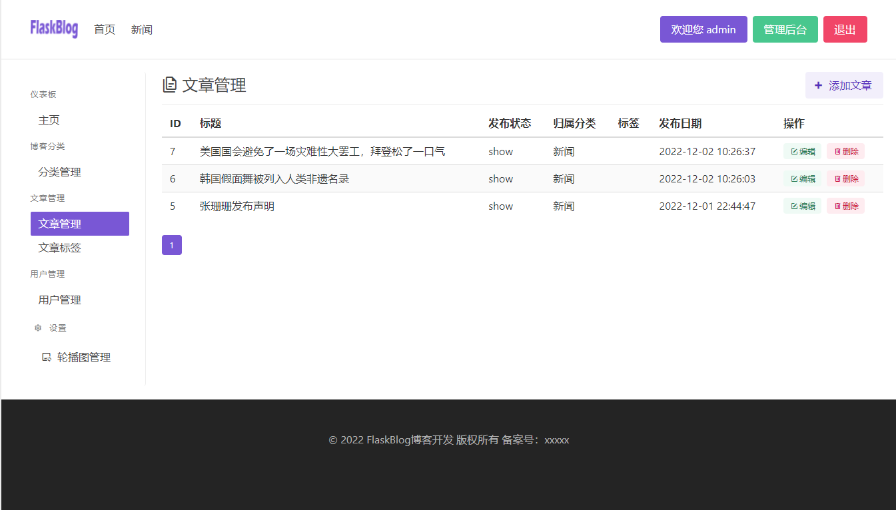
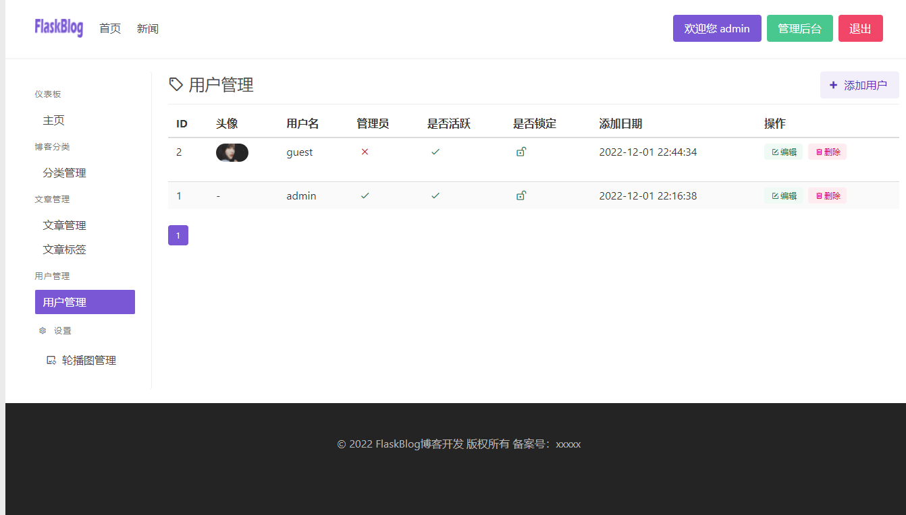
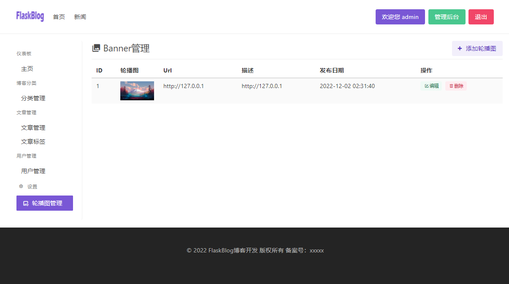
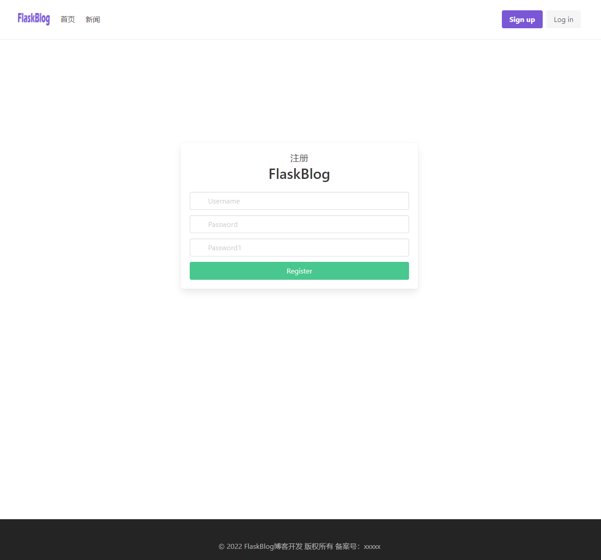

## FlaskBlog


## 简介

本博客代码是基于[bilibili-up-轻编程](https://space.bilibili.com/432627585) 开发的blog基础上采用flask进行开发而成

涉及到的功能模块如下：

* 登录
* 注册
* 后台管理
* 分类管理
* 文章管理
* 用户管理
* 全站导航菜单栏
* 文章列表
* 文章详情
* 集成富文本编辑器
* 侧边栏文章归档
* 权限管理
* banner轮播图管理


## 开发文档
<details>
<summary>👉开发文档</summary>

开发过程&遇到的问题&现存bug都在[开发文档](https://github.com/LiuShiYa-github/FlaskBlog/tree/master/Development-Documentation) 中记录

</details>


## 快速体验
<details>
<summary>👉快速体验</summary>
采用docker-compose+shell的方式只需两步就可以部署完成，利于大家快速体验。


前提条件： 

机器可以连接外网； 

安装docker和docker-compose； 

没安装可以参照[install_docker.sh](https://github.com/LiuShiYa-github/ShellScript/blob/main/install_docker.sh)

**部署FlaskBlog**
```text
① git clone  https://github.com/LiuShiYa-github/FlaskBlog.git
② bash  FlaskBlog/docker-deploy/deploy.sh
访问http://ipaddress
账户名密码：admin/admin
```

</details>


## 效果展示
<details>
<summary>👉效果展示</summary>

首页


管理后台



文章管理




用户管理



banner轮播图管理




登录


注册



侧边栏搜索


文章详情

</details>


